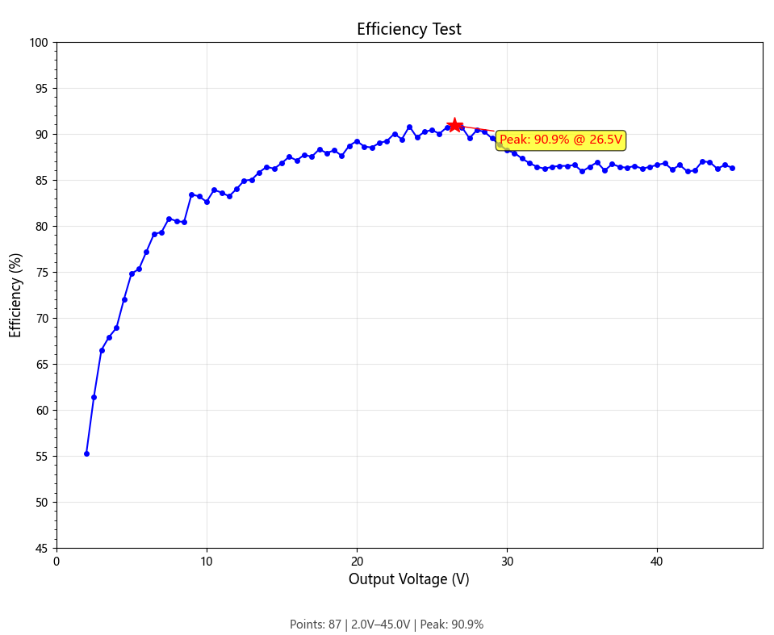
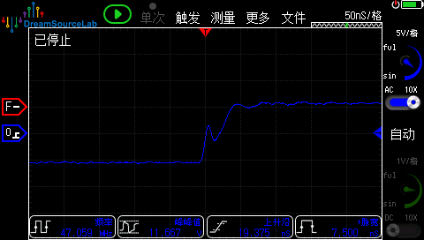
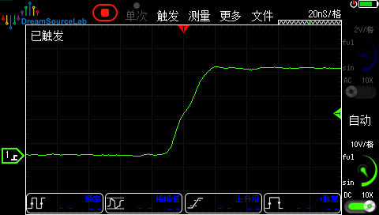
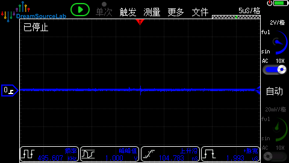
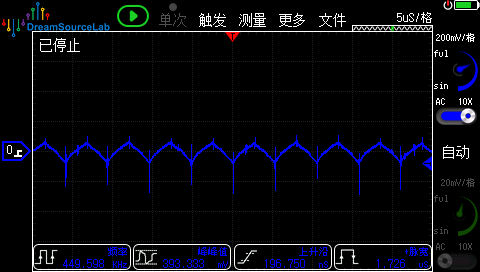
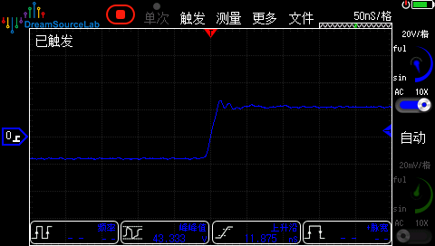
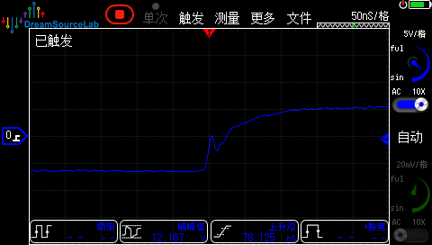
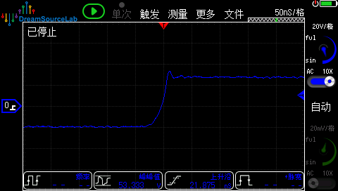

# LM25118 数控电源

基于 **TI LM25118** 同步降压-升压控制器和 **WCH CH32V006** RISC-V 微控制器的数控可调电源。支持恒压(CV)/恒流(CC)模式切换，具备完善的保护功能和直观的 OLED 人机交互界面。

## 性能参数



<div align="center">

*图 1：LM25118 在 3A 负载下的效率曲线*

</div>

---

## 开关波形

### 36→18V 降压

<table>
  <tr>
    <td align="center">
      
      <br><em>Buck FET Vgs (36→18V)</em>
    </td>
    <td align="center">
      
      <br><em>Buck FET Vsw (36→18V)</em>
    </td>
  </tr>
  <tr>
    <td align="center">
      
      <br><em>Boost FET Vgs (36→18V)</em>
    </td>
    <td align="center">
      
      <br><em>Boost FET Vsw (36→18V)</em>
    </td>
  </tr>
</table>

### 36→45V 升压

<table>
  <tr>
    <td align="center">
      
      <br><em>Buck FET Vgs (36→45V)</em>
    </td>
    <td align="center">
      
      <br><em>Buck FET Vsw (36→45V)</em>
    </td>
  </tr>
  <tr>
    <td align="center">
      
      <br><em>Boost FET Vgs (36→45V)</em>
    </td>
    <td align="center">
      
      <br><em>Boost FET Vsw (36→45V)</em>
    </td>
  </tr>
</table>

## 硬件平台

| 组件   | 型号                              | 说明                   |
| ---- | ------------------------------- | -------------------- |
| MCU  | CH32V006 (RISC-V RV32EC, 48MHz) | 62KB Flash / 8KB RAM |
| 电源控制 | LM25118                         | 宽输入同步降压-升压控制器        |
| 显示   | SSD1306 0.96" OLED (128x64)     | I2C 接口               |
| 输入   | 旋转编码器 + 按键                      | 参数调节与操作              |
| 指示灯  | WS2812 RGB LED                  | 状态指示                 |
| 温度传感 | NTC 热敏电阻                        | 电感/MOS管温度监测          |

## 功能特性

### 控制模式

- **恒压模式 (CV)** — 通过增量式 PID 闭环调节输出电压
- **恒流模式 (CC)** — 电流限制模式，PID 电流环前馈补偿
- **空闲模式 (IDLE)** — 输出关断，PWM 停止

### 保护功能

- **OVP** — 过压保护
- **OCP** — 过流保护
- **SCP** — 短路保护
- **OVT** — 过温保护 (阈值 80°C)

所有保护触发后进入故障锁定状态，需手动确认后恢复。

### 用户界面

- OLED 实时显示：输入/输出电压、电流、功率、效率、温度
- 旋转编码器调节：电压/电流/功率设定值，支持逐位微调
- WS2812 LED 状态指示：空闲(绿)、CV(红)、CC(金)、故障(白)
- 蜂鸣器提示音与故障报警
- 长按按键保存参数至 Flash

## 系统架构

```
                    +------------------+
  ADC 通道 (DMA):   |  Vin (Ch0)      |
  5通道循环采样       |  Iin (Ch1)      |
                    |  Vout (Ch2)     |
                    |  Iout (Ch3)     |
                    |  NTC (Ch4)      |
                    +--------+---------+
                             |
                    均值滤波 (定点数)
                             |
                    +--------v---------+
                    |   PID 控制器     |
                    |   - 电压环       |-----> TIM1 OC3 PWM (占空比)
                    |   - 电流环       |            |
                    +--------+---------+      LM25118
                             |             Buck-Boost
                    +--------v---------+
                    |    保护逻辑      |
                    | OVP / OCP / SCP / OVT |
                    +------------------+
```

- **PWM 频率**: 5 kHz (TIM1, RepetitionCounter 分频至 ~1kHz 控制环路)
- **滤波**: 10点滑动均值滤波（定点数优化，无浮点开销）
- **通信**: I2C (OLED, 800kHz) / SPI (WS2812) / UART (调试输出)

## 项目结构

```
LM25118_PowerModule/
├── Src/
│   ├── main.c                  # 主程序，状态机，保护逻辑
│   ├── ch32v00X_it.c           # 中断服务程序
│   ├── Startup/                # RISC-V 启动文件
│   ├── Ld/                     # 链接脚本
│   ├── Debug/                  # UART 调试输出
│   ├── Peripheral/             # WCH 外设驱动库
│   └── BSP/
│       ├── Inc/                # 头文件
│       └── Src/
│           ├── ADC.c           # ADC + DMA 多通道采样，均值滤波
│           ├── PID.c           # 增量式 PID 控制器
│           ├── Timer.c         # TIM1 PWM, TIM2 蜂鸣器
│           ├── Encoder.c       # 旋转编码器 + 按键驱动
│           ├── OLED.c          # SSD1306 驱动 (I2C)
│           ├── OLED_UI.c       # 电源 UI 界面
│           ├── WS2812.c        # WS2812 RGB LED (SPI)
│           ├── Buzzer.c        # 蜂鸣器队列 (PWM)
│           └── flash_param.c   # Flash 参数存储
└── IDE/
    ├── EIDE/                   # VS Code EIDE 工程
    └── MRS/                    # MounRiver Studio 工程
```

## 开发环境

支持两种 IDE：

- **EIDE (VS Code)** — 使用 `IDE/EIDE/` 下的工程配置
- **MounRiver Studio** — 使用 `IDE/MRS/` 下的工程配置

工具链：RISC-V GCC，目标架构 `rv32ec`，ABI `ilp32e`，编译优化 `-Os`。

### 编译与烧录

1. 使用 VS Code + EIDE 插件或 MounRiver Studio 打开对应工程
2. 编译生成 `.hex` / `.bin` 固件
3. 通过 WCH-Link 烧录

### 特殊烧录说明：保留 Flash 参数

本项目的参数存储在 Flash 末尾区域，每次烧录时需特殊处理以避免参数丢失。

#### Flash 布局

| 区域  | 地址                          | 大小                                |
| --- | --------------------------- | --------------------------------- |
| 代码区 | `0x08000000` – `0x0800EFFF` | 60 KB                             |
| 参数区 | `0x0800F000` – `0x0800F7FF` | 2 KB （`flash_param_t`, 实际使用 1 KB） |

#### 为什么需要特殊处理

WCH OpenOCD 的 `wch_riscv` 驱动中，`flash erase_sector` 命令**无视指定的 sector 范围**，无论传 `0 59` 还是 `0 last`，都执行全片擦除。因此无法通过限制 sector 范围来保护参数区。

#### 解决方式

烧录脚本 `IDE/EIDE/download.bat` 使用 **dump → 全擦 → 写代码 → 恢复参数** 的流程：

```
① dump_image  备份参数区 (0x0800F000, 1KB)  → 临时文件
② erase_sector 擦全片
③ program     写入固件
④ write_image 恢复参数区 (0x0000F000)
```

每次烧录时自动执行以上步骤，对用户透明。

> **⚠️ 历史问题：** 旧版脚本使用 `%%TEMP%%\param_%%RANDOM%%.bin` 作为临时文件名，
> OpenOCD 不识别 Windows 盘符路径（`C:\Users\...`），将其解释为相对路径，
> 导致每次烧录在 `IDE/EIDE/` 下生成 `UsersKun…param_*.bin` 垃圾文件。
> 已修正为固定文件名 `param_dump.bin`，烧录前后自动清理。

#### 手动 OpenOCD 命令

```bash
openocd -f ./wch-riscv.cfg ^
-c init ^
-c halt ^
-c "dump_image param_backup.bin 0x0800F000 0x400" ^
-c "flash erase_sector wch_riscv 0 last" ^
-c "program firmware.hex" ^
-c "flash write_image param_backup.bin 0x0000F000" ^
-c wlink_reset_resume ^
-c exit
```

#### 参数地址变更记录

参数区原定义在 `CFG_ADDRESS = 0x08001770`（位于代码区中间），每次烧录代码都会覆盖参数。已在提交中更正为 `0x0800F000`（Flash 末尾 1 KB 边界，链接器已限死代码 60 KB）。

## I2C 总线容错

OLED 通过硬件 I2C（800 kHz）与 SSD1306 通信。手指触碰 SCL/SDA 引脚时，
人体耦合电容会破坏 I2C 帧，导致总线锁死（SCL 被拉低）。

### 问题表现

| 场景 | 旧行为（无容错） | 当前行为 |
|------|----------------|---------|
| 手指短暂触碰 | 系统卡死（while 无超时） | I2C 传输超时 → 标记故障 → 主循环恢复 |
| 手指持续按住 | 系统卡死 | I2C 持续重试失败，但按键/编码器仍响应 |
| 手指松开 | 需手动复位 | 下一轮 `OLED_Init()` 恢复显示 |

### 实现机制

```
I2C1_ER ISR（总线错误中断）
  ├─ 清全部错误标志（BERR + ARLO + AF + OVR）
  └─ i2c_bus_fault = 1

HAL_I2C_Master_Transmit 超时（10000 次计数）
  └─ i2c_bus_fault = 1

主循环检测到 i2c_bus_fault
  ├─ i2c_bus_fault = 0
  ├─ OLED_Init() → I2C_DeInit() + GPIO SCL 恢复 + 完整重配
  └─ OLED_UI_Draw_Static() 刷新显示
```

### 关键改动

| 文件 | 改动 |
|------|------|
| `Src/ch32v00X_it.c` | ISR 清全部错误标志，设 `i2c_bus_fault`，不调 `OLED_Init()` |
| `Src/BSP/src/OLED.c` | 每个 while 加超时计数；`OLED_IO_Init()` 先 `I2C_DeInit()` 再 GPIO 操作 |
| `Src/BSP/inc/OLED.h` | 声明 `extern volatile uint8_t i2c_bus_fault` |
| `Src/main.c` | 主循环检测标志，安全调用 `OLED_Init()` 恢复 |

## 通信与调试

- **UART**: 115200 baud，输出 Vin/Vout 等实时数据
- **OLED**: I2C 接口，显示完整的电源运行参数
- **WS2812**: 通过 SPI 模拟时序驱动单颗 RGB LED

## Acknowledgments

- **DeepSeek** — AI 辅助编码与调试支持

## License

GNU General Public License v3.0 (GPL v3)

See [LICENSE](LICENSE) for the full text.

### 核心要求

| 你可以 | 你必须 |
|--------|--------|
| ✅ 商用、出售 | 📄 保留版权声明 |
| ✅ 修改、分发 | 📄 公开修改后的源代码 |
| ✅ 用于任何目的 | 📄 同样使用 GPL v3 发布 |
